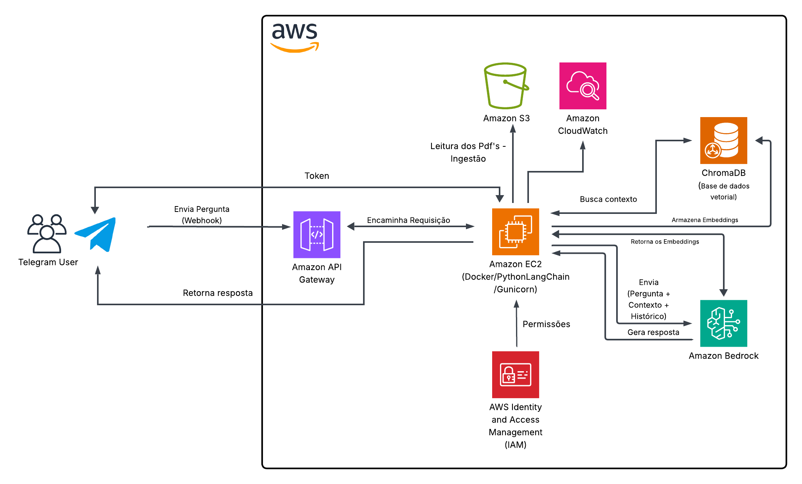

# 📖 Chatbot Jurídico com AWS Bedrock e LangChain

       

> Chatbot jurídico que responde perguntas usando documentos PDF, AWS Bedrock, LangChain e ChromaDB, com uma interface no Telegram e deploy containerizado.

---

## Sumário
1. [Sobre o Projeto](#1-sobre-o-projeto)
2. [Arquitetura da Solução](#2-arquitetura-da-solução)
3. [Tecnologias Utilizadas](#3-tecnologias-utilizadas)
4. [Como Executar o Sistema](#4-como-executar-o-sistema)
5. [Acesso ao Chatbot](#5-acesso-ao-chatbot)
6. [Desafios, Análise de Resultados e Limitações](#6-desafios-análise-de-resultados-e-limitações)
7. [Autores](#7-autores)

---

### 1. Sobre o Projeto

Este projeto foi desenvolvido como parte do programa de bolsas da Compass UOL para formação em Inteligência Artificial para AWS (Sprints 7 e 8). O objetivo é construir um chatbot funcional para consulta de documentos jurídicos, utilizando uma arquitetura de **Geração Aumentada por Recuperação (RAG)**.

O chatbot é capaz de responder a perguntas em linguagem natural com base em uma coleção de documentos PDF previamente carregados. Ele utiliza os serviços de IA Generativa da AWS, orquestrados pela biblioteca LangChain, para encontrar trechos relevantes nos documentos e formular respostas coesas e precisas, evitando o uso de conhecimento externo.

---

### 2. Arquitetura da Solução

A solução foi implementada utilizando um **API Gateway** como ponto de entrada para receber notificações de webhook do Telegram. Esse gateway repassa as requisições para a aplicação principal, que roda em um contêiner Docker numa instância **Amazon EC2** e centraliza toda a lógica de negócio.

Os componentes principais são:

- **Interface do Usuário:**
  - **Telegram:** Plataforma de mensagens utilizada para a interação do usuário com o chatbot.

- **Computação e Lógica da Aplicação:**
  - **Amazon EC2:** Instância que hospeda a aplicação containerizada com Docker. Ela gerencia todo o fluxo de processamento do RAG e a lógica de conversação.
  - **LangChain:** Framework utilizado para orquestrar toda a lógica do RAG, conectando a base de conhecimento, os modelos de IA e a memória da conversa.

- **Base de Conhecimento (RAG):**
  - **Amazon S3:** Bucket utilizado para armazenar de forma permanente os documentos jurídicos originais em formato PDF.
  - **ChromaDB:** Banco de dados vetorial que armazena os *embeddings* dos documentos. É a base de conhecimento que o LangChain consulta para encontrar os trechos de texto relevantes.
  - **Amazon Bedrock:** Serviço de IA Generativa da AWS, utilizado para duas finalidades:
    1.  **Geração de Embeddings:** Com o modelo `amazon.titan-embed-text-v2:0`, para converter os textos dos documentos e as perguntas dos usuários em vetores numéricos.
    2.  **Geração de Texto:** Com o modelo `mistral.mistral-large-2402-v1:0`, para formular as respostas finais com base no contexto recuperado.

- **Monitoramento:**
  - **Amazon CloudWatch:** Serviço utilizado para armazenar e visualizar de forma centralizada todos os logs de interação e erros gerados pela aplicação.

 #### Diagrama do Fluxo do Chatbot
 
<p align="center">
  
</p>
 
 > Este diagrama representa o fluxo de dados entre o usuário, Telegram, API Gateway, EC2, ChromaDB e Bedrock.
 
 ---

### 3. Tecnologias Utilizadas

- **Linguagem:** Python 3.10
- **Cloud:** AWS (EC2, S3, Bedrock, API Gateway, IAM, CloudWatch)
- **Containerização:** Docker, Docker Compose
- **Frameworks de IA:** LangChain, LangChain AWS
- **Banco de Dados Vetorial:** ChromaDB
- **Servidor Web:** Flask, Gunicorn
- **Interface:** Python-Telegram-Bot
- **Bibliotecas Principais:** Boto3, PyPDF, Python-dotenv

---

### 4. Como Executar o Sistema

Siga os passos abaixo para configurar e executar o projeto.

#### Pré-requisitos
- Conta na AWS com permissões para criar e gerenciar EC2, S3, IAM Roles, API Gateway e Bedrock.
- Git, Docker e Docker Compose instalados.
- Um bucket no S3 populado com os documentos `.pdf`.
- Um bot criado no Telegram para obter o Token de acesso.

#### a. Configuração do Projeto

### Ainda vou ajustar essa parte quando subir para o repo da Compass

1.  Clone o repositório:
    ```bash
    git clone [Ainda vou adicionar o url do repo]
    cd [Ainda vou adicionar o nome da pasta do repo]
    ```
2.  Crie e configure o arquivo de variáveis de ambiente `.env` na raiz do projeto:
    ```env
    TELEGRAM_BOT_API_KEY=[TOKEN_DO_TELEGRAM]
    S3_BUCKET_NAME=[NOME_DO_BUCKET_S3]
    AWS_REGION_NAME=us-east-1
    CLOUDWATCH_LOG_GROUP=[NOME_PARA_O_GRUPO_DE_LOGS]
    ```

#### b. Ingestão dos Dados

Este é um passo único de configuração para processar os documentos do S3 e popular a base de dados vetorial. Execute o comando a partir da raiz do projeto na sua máquina ou na instância EC2.

1.  **Instale as dependências na máquina host:**
    ```bash
    pip install -r requirements.txt
    ```
2.  **Execute o script de ingestão:**
    ```bash
    python -m scripts.ingest_data
    ```
*Obs: Garanta que suas credenciais da AWS estejam configuradas no ambiente (preferencialmente via IAM Role na EC2) para que o script possa acessar o S3 e o Bedrock.*

#### c. Execução do Servidor com Docker Compose

Com a base de dados `chroma_db` criada localmente pelo script de ingestão, inicie o servidor do chatbot.

1.  **Construa a imagem e inicie o serviço:**
    ```bash
    sudo docker compose up --build -d
    ```
2.  **Para visualizar os logs em tempo real:**
    ```bash
    sudo docker compose logs -f
    ```
3.  **Para parar o serviço:**
    ```bash
    sudo docker compose down
    ```

#### d. Configurar o Webhook do Telegram

Após iniciar o serviço, você precisa dizer ao Telegram para onde enviar as mensagens, utilizando o endpoint público do seu API Gateway.

### Ainda vou ajustar essa parte quando subir para o repo da Compass
```bash
curl -X POST https://api.telegram.org/bot<SEU_TOKEN>/setWebhook -H "Content-Type: application/json" -d '{"url": "<URL_PUBLICA_DA_APLICACAO>/webhook"}'
```

### 5. Acesso ao Chatbot

Para interagir com o chatbot, acesse o link público do bot no Telegram.

**Link:** `http://t.me/rag_judicial_bot`

---

### 6. Desafios, Análise de Resultados e Limitações

Apesar da arquitetura estar 100% funcional, os testes de qualidade revelaram uma **inconsistência na precisão das respostas** para perguntas jurídicas complexas. O chatbot frequentemente falhava em extrair os fundamentos legais corretos ou as provas decisivas citadas nos acórdãos.

**Diagnóstico:** Após um extenso processo de depuração e otimização, a causa raiz foi identificada como uma **limitação do modelo de embedding** (`amazon.titan-embed-text-v2:0`) disponível para o projeto. Este modelo não se mostrou capaz de capturar as nuances semânticas de textos jurídicos densos, resultando em uma recuperação de contexto (Retrieval) imprecisa. O sistema falhava em encontrar os trechos corretos dos documentos, levando o LLM (mesmo um modelo poderoso como o Mistral Large) a gerar respostas incorretas ou alucinadas.

Durante o desenvolvimento, diversas técnicas foram aplicadas na tentativa de mitigar este problema:
- Upgrade do LLM de `Amazon Titan` para `Mistral Large`.
- Implementação de um prompt avançado com a técnica de "Chain of Thought".
- Refatoração da estratégia de RAG para utilizar o `Parent Document Retriever`.
- Testes com diferentes modelos de embedding disponíveis.

**Conclusão:** O projeto foi um sucesso na implementação da arquitetura RAG de ponta a ponta na AWS, mas também serviu para demonstrar um desafio prático da tecnologia: a performance de um sistema RAG é criticamente dependente da qualidade do seu modelo de embedding, especialmente em domínios de conhecimento altamente especializados como o Direito.

---

### 7. Autores

Este projeto foi desenvolvido pela **Squad 6** como parte do programa de bolsas da Compass UOL.

* [Agnes Ludmilla](https://github.com/agnesludmila)
* [Yuri Kiev](https://github.com/YuriKievBarreto)
* [Rafaela Bezerra](https://github.com/Rafa01B)
* [Rudhá Esmeraldo](https://github.com/rudhaesmeraldo)